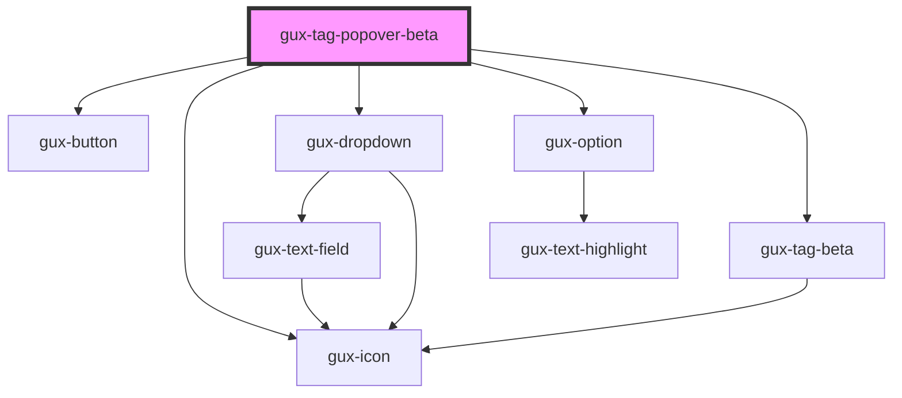

# gux-tag-popover

<!-- Auto Generated Below -->

## Properties

| Property   | Attribute  | Description                                              | Type                                                                                                                                                   | Default     |
| ---------- | ---------- | -------------------------------------------------------- | ------------------------------------------------------------------------------------------------------------------------------------------------------ | ----------- |
| `color`    | `color`    | Tags color                                               | `"aqua-green" \| "blue" \| "bubblegum-pink" \| "dark-purple" \| "electric-purple" \| "fuscha" \| "lilac" \| "navy" \| "olive-green" \| "yellow-green"` | `undefined` |
| `position` | `position` | Indicates the position of the tag button (right or left) | `string`                                                                                                                                               | `'left'`    |

## Dependencies

### Depends on

- [gux-button](../../stable/gux-button)
- [gux-icon](../../stable/gux-icon)
- [gux-dropdown](../../stable/gux-dropdown)
- [gux-option](../../stable/gux-dropdown/gux-option)
- [gux-tag-beta](../gux-tag)

### Graph

----------------------------------------------

*Built with [StencilJS](https://stenciljs.com/)*
