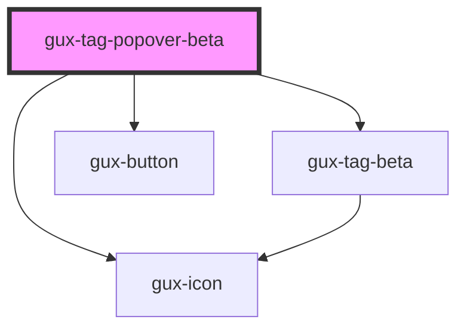

# gux-tag-popover

<!-- Auto Generated Below -->

## Properties

| Property   | Attribute  | Description                                              | Type      | Default     |
| ---------- | ---------- | -------------------------------------------------------- | --------- | ----------- |
| `color`    | `color`    | Tags color                                               | `string`  | `undefined` |
| `disabled` | `disabled` | Disable the button.                                      | `boolean` | `false`     |
| `position` | `position` | Indicates the position of the tag button (right or left) | `string`  | `'left'`    |

## Dependencies

### Depends on

- [gux-tag-beta](../gux-tag)
- [gux-button](../../stable/gux-button)
- [gux-icon](../../stable/gux-icon)

### Graph

----------------------------------------------

*Built with [StencilJS](https://stenciljs.com/)*
