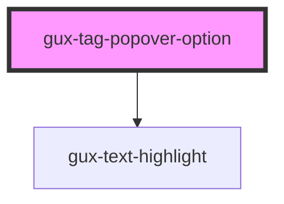

# gux-dropdown-option

<!-- Auto Generated Below -->

## Properties

| Property | Attribute | Description | Type     | Default     |
| -------- | --------- | ----------- | -------- | ----------- |
| `icon`   | `icon`    |             | `string` | `undefined` |
| `text`   | `text`    |             | `string` | `undefined` |

## Events

| Event             | Description | Type                       |
| ----------------- | ----------- | -------------------------- |
| `selectedChanged` |             | `CustomEvent<HTMLElement>` |

## Dependencies

### Depends on

- [gux-text-highlight](../../../stable/gux-text-highlight)

### Graph

----------------------------------------------

*Built with [StencilJS](https://stenciljs.com/)*
