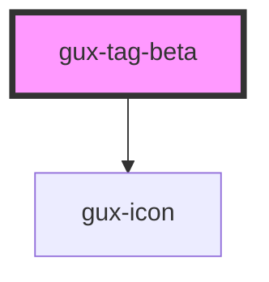

# gux-tag

<!-- Auto Generated Below -->

## Properties

| Property   | Attribute   | Description           | Type      | Default     |
| ---------- | ----------- | --------------------- | --------- | ----------- |
| `close`    | `close`     | Tag close button.     | `boolean` | `undefined` |
| `color`    | `color`     | Tag background color. | `string`  | `undefined` |
| `icon`     | `icon`      | Tag icon.             | `string`  | `undefined` |
| `light`    | `light`     | Label text color.     | `boolean` | `undefined` |
| `outlined` | `outlined`  | Tag border.           | `boolean` | `undefined` |
| `textBold` | `text-bold` | Label text bold.      | `boolean` | `undefined` |

## Dependencies

### Depends on

- [gux-icon](../../stable/gux-icon)

### Graph

----------------------------------------------

*Built with [StencilJS](https://stenciljs.com/)*
