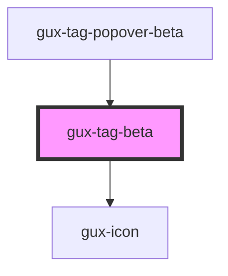

# gux-tag

<!-- Auto Generated Below -->

## Properties

| Property | Attribute | Description           | Type                                                                                                                                                   | Default     |
| -------- | --------- | --------------------- | ------------------------------------------------------------------------------------------------------------------------------------------------------ | ----------- |
| `color`  | `color`   | Tag background color. | `"aqua-green" \| "blue" \| "bubblegum-pink" \| "dark-purple" \| "electric-purple" \| "fuscha" \| "lilac" \| "navy" \| "olive-green" \| "yellow-green"` | `undefined` |
| `tagId`  | `tag-id`  | Index for remove tag  | `string`                                                                                                                                               | `undefined` |

## Events

| Event       | Description                          | Type               |
| ----------- | ------------------------------------ | ------------------ |
| `deleteTag` | Triggered when click on close button | `CustomEvent<any>` |

## Dependencies

### Used by

 - [gux-tag-popover-beta](../gux-tag-popover)

### Depends on

- [gux-icon](../../stable/gux-icon)

### Graph

----------------------------------------------

*Built with [StencilJS](https://stenciljs.com/)*
