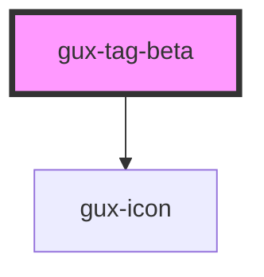

# gux-tag

<!-- Auto Generated Below -->

## Properties

| Property | Attribute | Description           | Type                                                                                                                                   | Default     |
| -------- | --------- | --------------------- | -------------------------------------------------------------------------------------------------------------------------------------- | ----------- |
| `color`  | `color`   | Tag background color. | `"blue" \| "dark-blue" \| "dark-pink" \| "dark-purple" \| "dark-yellow" \| "light-purple" \| "pink" \| "purple" \| "teal" \| "yellow"` | `undefined` |
| `index`  | `index`   | Index for remove tag  | `number`                                                                                                                               | `undefined` |

## Events

| Event       | Description                          | Type               |
| ----------- | ------------------------------------ | ------------------ |
| `deleteTag` | Triggered when click on close button | `CustomEvent<any>` |

## Dependencies

### Depends on

- [gux-icon](../../stable/gux-icon)

### Graph

----------------------------------------------

*Built with [StencilJS](https://stenciljs.com/)*
